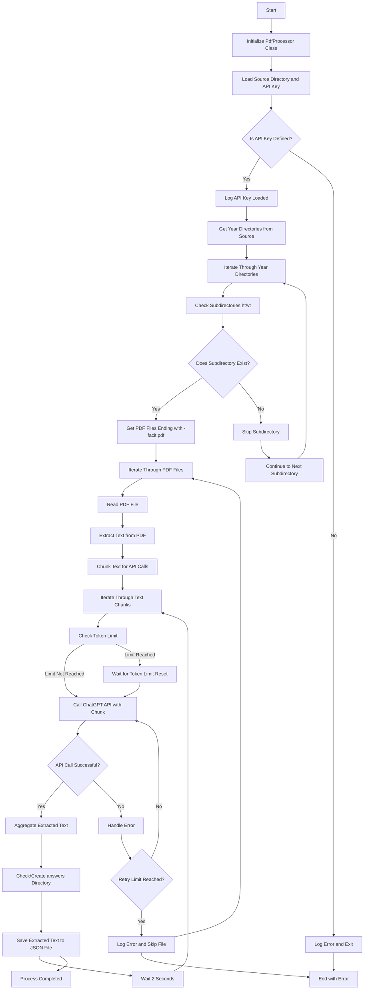

# Extract Answer Workflow

```mermaid
graph TD
    A[Start] --> B[Initialize PdfProcessor Class]
    B --> C[Load Source Directory and API Key]
    C --> D{Is API Key Defined?}
    D -->|Yes| E[Log API Key Loaded]
    D -->|No| F[Log Error and Exit]

    E --> G[Get Year Directories from Source]
    G --> H[Iterate Through Year Directories]
    H --> I[Check Subdirectories ht/vt]
    I --> J{Does Subdirectory Exist?}
    J -->|Yes| K[Get PDF Files Ending with -facit.pdf]
    J -->|No| L[Skip Subdirectory]

    K --> M[Iterate Through PDF Files]
    M --> N[Read PDF File]
    N --> O[Extract Text from PDF]
    O --> P[Chunk Text for API Calls]
    P --> Q[Iterate Through Text Chunks]
    Q --> R[Check Token Limit]
    R -->|Limit Not Reached| S[Call ChatGPT API with Chunk]
    R -->|Limit Reached| T[Wait for Token Limit Reset] --> S

    S --> U{API Call Successful?}
    U -->|Yes| V[Aggregate Extracted Text]
    U -->|No| W[Handle Error]

    V --> X[Check/Create answers Directory]
    X --> Y[Save Extracted Text to JSON File]
    Y --> Z[Wait 2 Seconds]
    Z --> Q
    L --> AA[Continue to Next Subdirectory]
    AA --> H

    W --> AB{Retry Limit Reached?}
    AB -->|No| S
    AB -->|Yes| AC[Log Error and Skip File]
    AC --> M

    F --> AD[End with Error]
    AC --> AD
    Y --> AE[Process Completed]
```