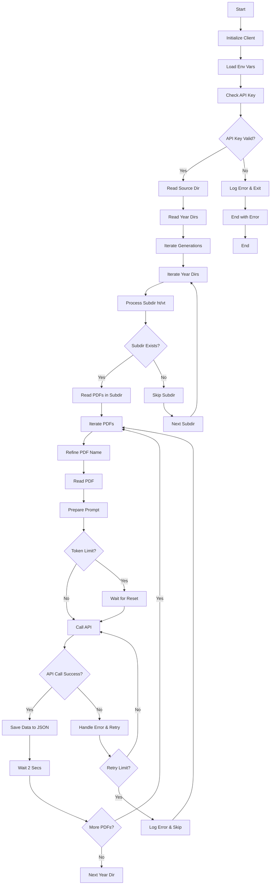

# OpenAI Client Workflow

```mermaid
graph TD
    A[Start] --> B[Initialize Client]
    B --> C[Load Env Vars]
    C --> D[Check API Key]
    D --> E{API Key Valid?}
    E -->|Yes| F[Read Source Dir]
    E -->|No| G[Log Error & Exit]

    F --> H[Read Year Dirs]
    H --> I[Iterate Generations]
    I --> J[Iterate Year Dirs]
    J --> K[Process Subdir ht/vt]
    K --> L{Subdir Exists?}
    L -->|Yes| M[Read PDFs in Subdir]
    L -->|No| N[Skip Subdir]

    M --> O[Iterate PDFs]
    O --> P[Refine PDF Name]
    P --> Q[Read PDF]
    Q --> R[Prepare Prompt]

    R --> S{Token Limit?}
    S -->|No| T[Call API]
    S -->|Yes| U[Wait for Reset]
    U --> T

    T --> V{API Call Success?}
    V -->|Yes| W[Save Data to JSON]
    V -->|No| X[Handle Error & Retry]

    W --> Y[Wait 2 Secs]
    Y --> Z{More PDFs?}
    Z -->|Yes| O
    Z -->|No| AA[Next Year Dir]

    N --> AB[Next Subdir]
    AB --> J

    X --> AC{Retry Limit?}
    AC -->|No| T
    AC -->|Yes| AD[Log Error & Skip]
    AD --> O

    G --> AE[End with Error]
    AE --> AF[End]
```

