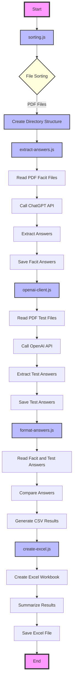

# Overview Workflow

```mermaid
flowchart TD
    A[Start] --> B[sorting.js]
    B --> C{File Sorting}
    C --> |PDF Files| D[Create Directory Structure]
    D --> E[extract-answers.js]
    E --> F[Read PDF Facit Files]
    F --> G[Call ChatGPT API]
    G --> H[Extract Answers]
    H --> I[Save Facit Answers]
    
    I --> J[openai-client.js]
    J --> K[Read PDF Test Files]
    K --> L[Call OpenAI API]
    L --> M[Extract Test Answers]
    M --> N[Save Test Answers]
    
    N --> O[format-answers.js]
    O --> P[Read Facit and Test Answers]
    P --> Q[Compare Answers]
    Q --> R[Generate CSV Results]
    
    R --> S[create-excel.js]
    S --> T[Create Excel Workbook]
    T --> U[Summarize Results]
    U --> V[Save Excel File]
    
    V --> W[End]
    
    classDef start fill:#f9f,stroke:#333,stroke-width:4px;
    classDef process fill:#bbf,stroke:#333,stroke-width:2px;
    classDef decision fill:#ffd,stroke:#333,stroke-width:2px;
    
    class A,W start;
    class B,D,E,J,O,S process;
    class C decision;
```