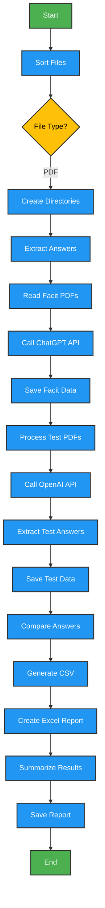

# Overview Workflow

```mermaid
flowchart TD
    A[Start] --> B[Sort Files] --> C{File Type?} 
    C -->|PDF| D[Create Directories] --> E[Extract Answers] 
    E --> F[Read Facit PDFs] --> G[Call ChatGPT API] --> H[Save Facit Data]
    
    H --> I[Process Test PDFs] --> J[Call OpenAI API] --> K[Extract Test Answers] --> L[Save Test Data] 

    L --> M[Compare Answers] 
    M --> N[Generate CSV] --> O[Create Excel Report] 
    O --> P[Summarize Results] --> Q[Save Report] --> R[End]

    classDef start fill:#4CAF50,stroke:#333,stroke-width:2px,color:#fff;
    classDef process fill:#2196F3,stroke:#333,stroke-width:2px,color:#fff;
    classDef decision fill:#FFC107,stroke:#333,stroke-width:2px,color:#000;

    class A,R start;
    class B,D,E,F,G,H,I,J,K,L,M,N,O,P,Q process;
    class C decision;
```
