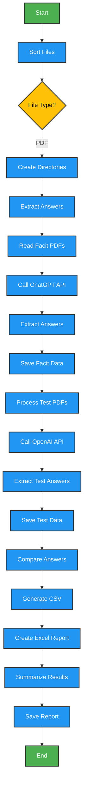

# Overview Workflow

```mermaid
flowchart TD
    A[Start] --> B[Sort Files]
    B --> C{File Type?}
    C --> |PDF| D[Create Directories]
    D --> E[Extract Answers]
    E --> F[Read Facit PDFs]
    F --> G[Call ChatGPT API]
    G --> H[Extract Answers]
    H --> I[Save Facit Data]
    
    I --> J[Process Test PDFs]
    J --> K[Call OpenAI API]
    K --> L[Extract Test Answers]
    L --> M[Save Test Data]
    
    M --> N[Compare Answers]
    N --> O[Generate CSV]
    
    O --> P[Create Excel Report]
    P --> Q[Summarize Results]
    Q --> R[Save Report]
    
    R --> S[End]
    
    classDef start fill:#4CAF50,stroke:#333,stroke-width:2px,color:#fff;
    classDef process fill:#2196F3,stroke:#333,stroke-width:2px,color:#fff;
    classDef decision fill:#FFC107,stroke:#333,stroke-width:2px,color:#000;
    
    class A,S start;
    class B,D,E,F,G,H,I,J,K,L,M,N,O,P,Q,R process;
    class C decision;
```
