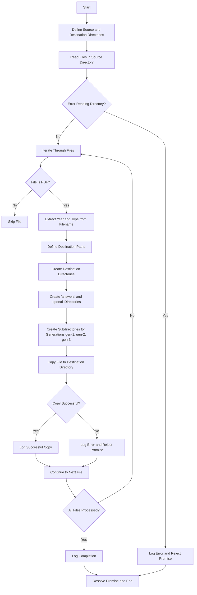

# Sorting Workflow

```mermaid
graph TD
    A[Start] --> B[Define Source and Destination Directories]
    B --> C[Read Files in Source Directory]
    C --> D{Error Reading Directory?}
    D -->|Yes| E[Log Error and Reject Promise]
    D -->|No| F[Iterate Through Files]

    F --> G{File is PDF?}
    G -->|No| H[Skip File]
    G -->|Yes| I[Extract Year and Type from Filename]

    I --> J[Define Destination Paths]
    J --> K[Create Destination Directories]
    K --> L[Create 'answers' and 'openai' Directories]
    L --> M[Create Subdirectories for Generations gen-1, gen-2, gen-3]

    M --> N[Copy File to Destination Directory]
    N --> O{Copy Successful?}
    O -->|Yes| P[Log Successful Copy]
    O -->|No| Q[Log Error and Reject Promise]

    P --> R[Continue to Next File]
    Q --> R

    R --> S{All Files Processed?}
    S -->|No| F
    S -->|Yes| T[Log Completion]

    T --> U[Resolve Promise and End]
    E --> U
```
